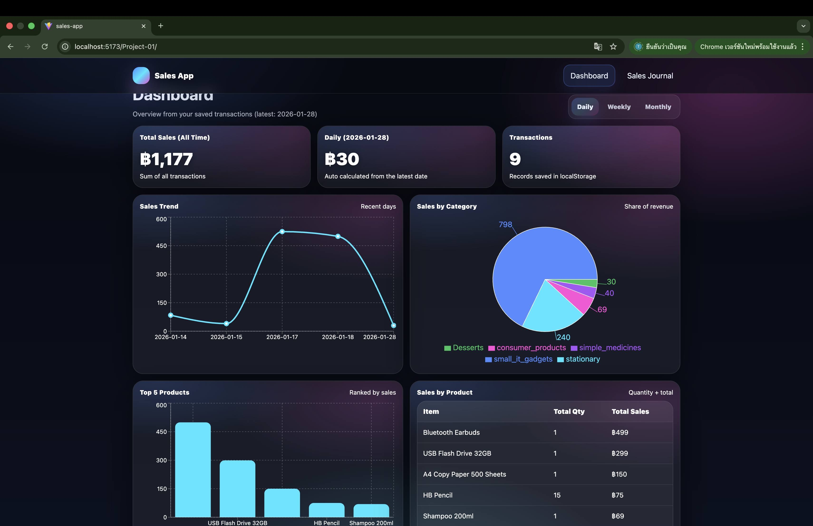
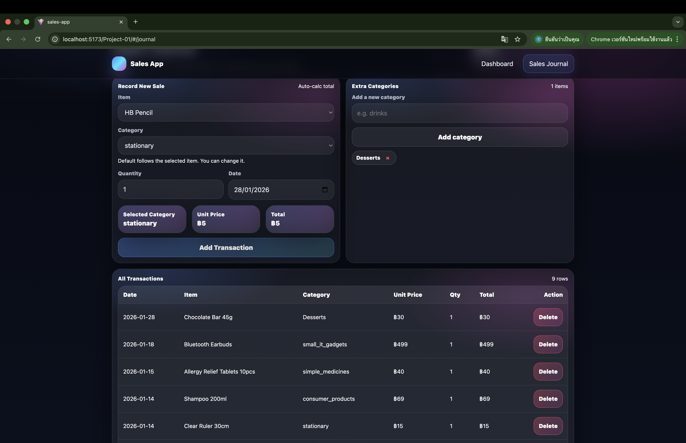

# Sales App – Basic POS System

This project is a React JS web application developed as part of the CSX4107 course assignment.

The application is a simple Point of Sale (POS) system that allows users to record sales transactions and view sales summaries.  
All data is stored locally using the browser’s localStorage, with no backend involved.

---

## Application Features

### Page 1: Dashboard
- Display total sales of all time
- Show sales summary by period (Daily / Weekly / Monthly)
- Show sales by product
- Show top 5 selling items
- Visualizations:
  - Line chart for sales trend
  - Pie chart for sales proportion by category

### Page 2: Sales Journal
- Record new sales by selecting product, quantity, and date
- Automatically calculate total price
- Display a table of all transactions
- Data persistence using localStorage

---

## Screenshots

### Dashboard Page

### Sales Journal Page

---

## Technologies Used
- React
- Vite
- JavaScript
- CSS
- localStorage

---

## Live Demo (GitHub Pages)
https://u6610936.github.io/Project-01/

---

## Team Members
- Thanakrit Kodklangdon 
- Kitirat Pisithaporn 